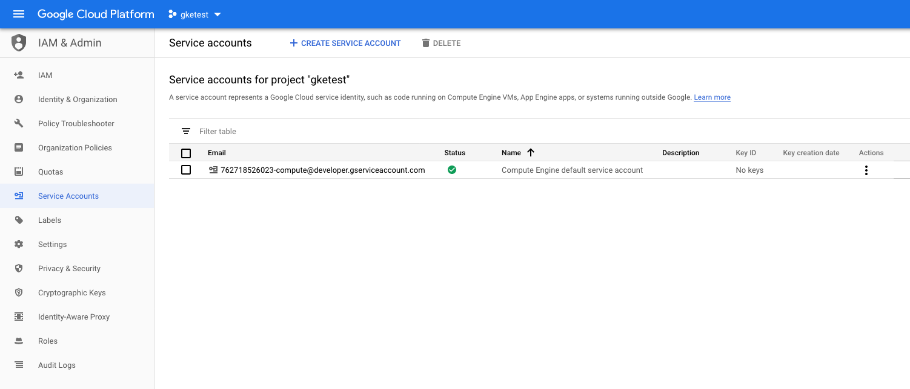
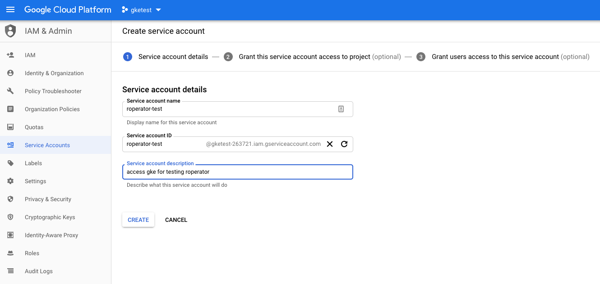
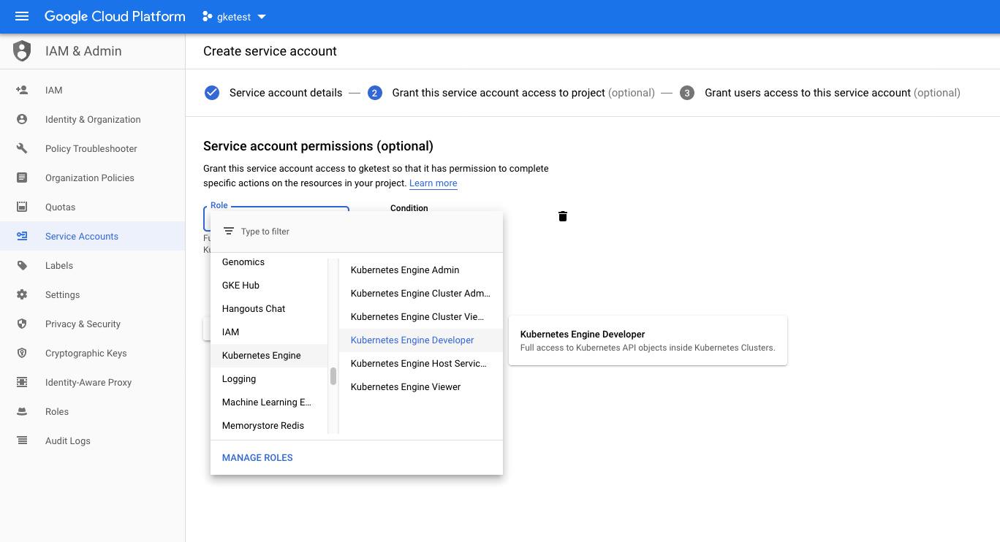

# Authenticating to GKE in a Local Development Environment

This page has instructions on how to get setup to run roperator locally against a GKE cluster. This is very useful for testing, but not the kind of thing you'd ever do in production. In production, you should almost certainly be using a [Kubernetes Service Account](./operator-config.md#Authentication) and running your operator in the cluster.

Roperator does not currently support oauth authentication directly. When you create a new GKE cluster, though, the configuration that's added to `~/.kube/config` will be for oauth authentication. This guide will walk you though creating a GCE Service Account (this is different from a _Kubernetes_ ServiceAccount) that you can use to authenticate to the GKE cluster.

The brief outline of the steps is:

1. Login to GCE and select your project
1. Create a Service Account and download a key
1. Use the downloaded key to generate a token
1. Tell Roperator to use your token

These instructions assume that you already have the `gcloud` command line tool installed, and that you've already got a project and a GKE cluster setup.

### Step 1: Get to the right page

Login to (https://console.cloud.google.com) and make sure you have your project selected. On the left nav bar, select "IAM & Admin" and then "Service Accounts". You should see something like the following example:



### Step 2: Create the Service Account

Now click the  button, then enter the "Service account name" and an optional description.



Once you're entered the name and hit "Create", it'll take you to the page shown below, where you'll select which roles to grant the account. Under Roles, select "Kubernetes Engine" and then "Kubernetes Engine Developer". This will grant access only to all resources within the cluster.



After you select the role, continue to the next part. This last page has a few fields about granting users access, which you can ignore. You're looking for the "Create Key (optional)" section. Click "+ CREATE KEY" and select the JSON format. Once you click "Create", it'll prompt you to download it. Make sure to keep that file safe! Anyone with access to that file will have access to your Kubernetes cluster.

### Step 3: Generate a token

Now that you have the JSON file, you'll use it to generate a token. Open up a terminal and run the following command, replacing `path/to/keyfile.json` with the actual path to the file that you downloaded in Step 2.

```sh
GOOGLE_APPLICATION_CREDENTIALS=path/to/keyfile.json gcloud auth application-default print-access-token
```

This should print the access token to the terminal. The token is only valid for one hour, so you'll need to re-run the above command to re-fresh the token.

### Step 4: Configure Roperator to Use the Token

At this point, all we really need to do is to setup a `ClientConfig` that includes your token for the `Credentials`. This is pretty simple to do in code.

```rust
use roperator::config::kubeconfig::KubeConfig;
use roperator::config::Credentials;
use roperator::runner::run_operator_with_client_config;

// Create the credentials from the token that we got above
let credentials = Credentials::base64_bearer_token("<the token from above>".to_string());
let (kubeconfig, kubeconfig_path) = KubeConfig::load().expect("failed to load kubeconfig");

// we need to supply a user-agent string and the parent path when we create a ClientConfig from a kubeconfig.
// The parent path is used to resolve relative paths to certificates
let user_agent = "my-user-agent-string".to_string();
let kubeconfig_parent_path = kubeconfig_path.parent().unwrap();

// now we can create the `ClientConfig`. This will return an error if the kubeconfig was invalid
let client_config_result = kubeconfig.create_client_config_with_credentials(user_agent, kubeconfig_parent_path, credentials);
let client_config = client_config_result.expect("failed to resolve cluster data from kubeconfig");

// now that we have the `client_config`, just pass it to the `run_operator_with_client_config` function.
// the `OperatorConfig` and `Handler` are the same as they are in other examples.
let run_result = run_operator_with_client_config(my_operator_config, client_config, my_handler);
```

Since the token is only valid for an hour, it would be inconvenient to copy/paste the new token every time you need to refresh. So we can make this easier by creating a script that refreshes the token and exports it as an environment variable. Then in our code, we can just take the token from the environment variable.

```sh
#!/bin/bash -e
export GOOGLE_APPLICATION_CREDENTIALS=path/to/keyfile.json
export ROPERATOR_AUTH_TOKEN=$(gcloud auth application-default print-access-token)

# or cargo test or whatever else
cargo run
```

Then, in your main function, you'll need to set the `Credentials` based on the `ROPERATOR_AUTH_TOKEN` variable. We can also do this conditionally, only if the env variable is set.

```rust
let user_agent = "my-user-agent-string".to_string();

let client_config_result = if let Ok(token) = std::env::var("ROPERATOR_AUTH_TOKEN") {
    let credentials = Credentials::base64_bearer_token(token);
    let (kubeconfig, kubeconfig_path) = KubeConfig::load().expect("failed to load kubeconfig");
    let kubeconfig_parent_path = kubeconfig_path.parent().unwrap();
    kubeconfig.create_client_config_with_credentials(user_agent, kubeconfig_parent_path, credentials)
} else {
    ClientConfig::from_kubeconfig(user_agent)
};
let client_config = client_config_result.expect("failed to resolve cluster data from kubeconfig");

let run_result = run_operator_with_client_config(my_operator_config, client_config, my_handler);
```
